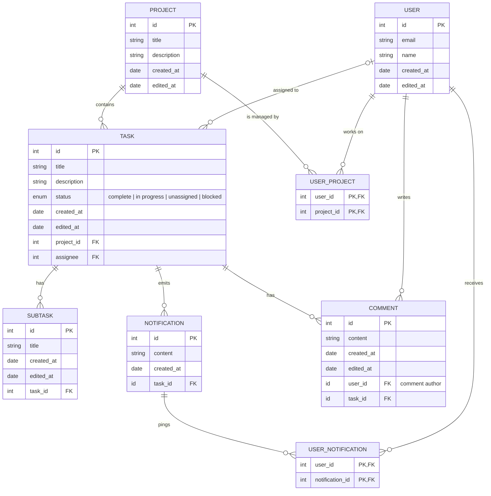
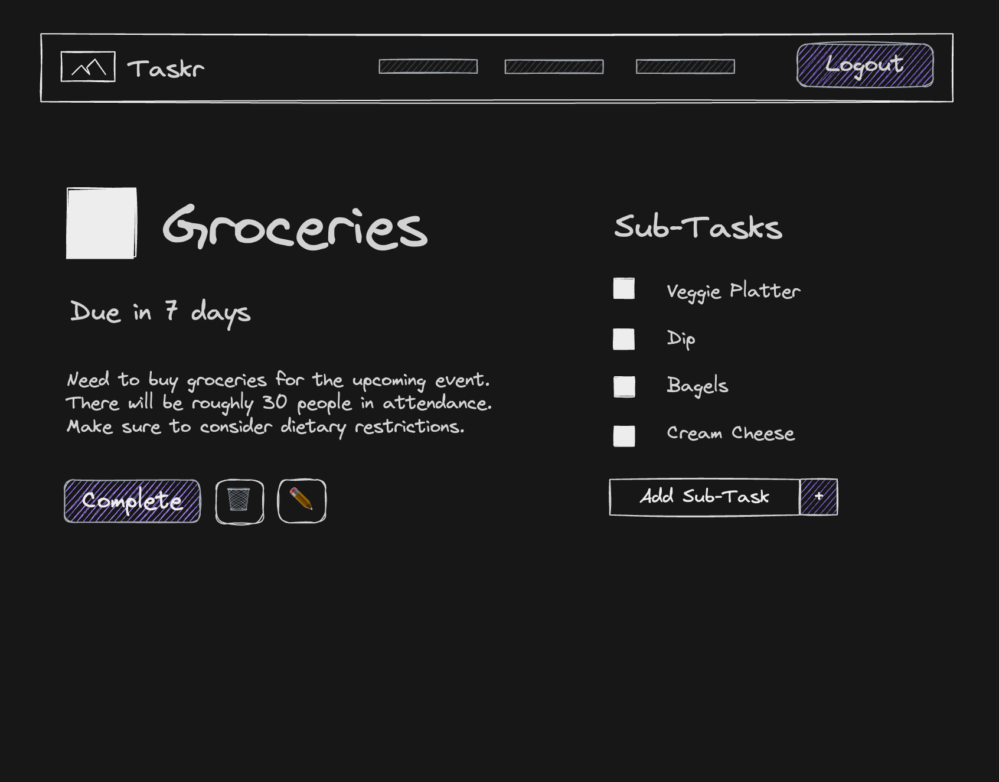

# 📝 **Pinteresting**

A powerful task and project management app that empowers users to collaborate, stay organized, and achieve their goals efficiently. 🎯✨

---

## 🧱 **Core Functionality**

### 🌟 Key Features:

- 🗂️ **Project Creation:** Users can create new shared projects with a title and description.
- 👥 **User Management:** Users can join existing projects using a unique project code.
- ✅ **Task Management:** Within a project, users can:
  - ➕ Create tasks with descriptions and due dates.
  - 👤 Assign tasks to specific project members.
  - ✔️ Mark tasks as completed.
- 🔔 **Basic Notifications:** Get notified when tasks are assigned or completed.
- 💬 **In-Task Chat:** Add comments to tasks for focused discussions.
- 🚦 **Custom Task Statuses:** Define statuses like "In Progress" or "Blocked."

---

## 🎯 **User Stories**

### 🛠️ **Task Stories**
- 📌 As a user, I want to **create tasks** to track what I need to get done.
- 📜 As a user, I want to **view tasks in a list** to see what needs my attention.
- ✏️ As a user, I want to **edit tasks** to update details or due dates.
- ✅ As a user, I want to **mark tasks as complete** to track my progress.
- 🗑️ As a user, I want to **delete tasks** when they are no longer relevant.

### 📂 **Project Stories**
- 🆕 As a user, I want to **create a new project** to organize related tasks.
- 🔗 As a user, I want to **join a project** using an invite code to collaborate.
- 📖 As a user, I want to **view all my projects** to switch between them easily.

### 👤 **User Management Stories**
- 🔐 As a user, I want to **register for an account** to start using the app.
- 🔑 As a user, I want to **log in to my account** to access my tasks and projects.
- 🚪 As a user, I want to **log out** to securely end my session.

### 💬 **Comment Stories**
- 💡 As a user, I want to **comment on tasks** to ask questions or provide updates.
- 👥 As a user, I want to **see comments from teammates** to stay informed.
- 📩 As a user, I want to **get notifications for comments** on tasks I'm involved with.

### 🚦 **Status Stories**
- 🛠️ As a user, I want to mark tasks as **"In Progress"** to show active work.
- 🚧 As a user, I want to mark tasks as **"Blocked"** when dependencies prevent progress.
- 📊 As a user, I want to **view tasks grouped by status** to get a project overview.

---

## 🔗 **Entity Relationships**

# 🌍 API Routes

## 🗂️ Project Management

| **Request**       | **Action**              | **Response**          | **Description**                                                             |
|--------------------|-------------------------|------------------------|-----------------------------------------------------------------------------|
| **POST** /projects | Create a new project   | `201 /projects/:id`   | Creates a project and redirects to its view.                               |
| **GET** /projects/:id | Fetch project details | `200 ProjectDetailView` | Retrieves details of a specific project.                                   |
| **PUT** /projects/:id | Update a project      | `200 ProjectDetailView` | Updates existing project details.                                          |
| **DELETE** /projects/:id | Delete a project   | `204 No Content`      | Deletes a project (decide task deletion implications).                     |

## ✅ Task Management

| **Request**                                | **Action**              | **Response**          | **Description**                          |
|--------------------------------------------|-------------------------|-----------------------|------------------------------------------|
| **POST** /projects/:projectId/tasks        | Create a task           | `201 /projects/:projectId` | Creates a task within a project.        |
| **GET** /projects/:projectId/tasks/:taskId | Get task details        | `200 TaskDetailView` | Fetches a specific task's details.       |
| **PUT** /projects/:projectId/tasks/:taskId | Update a task           | `200 TaskDetailView` | Edits an existing task.                  |
| **DELETE** /projects/:projectId/tasks/:taskId | Delete a task         | `204 No Content`     | Removes a task.                          |

---

# 🎨 Wireframes

## 📲 Login View

A simple screen for users to log in with their credentials. Includes a link to the registration page for new users.

---

## 📋 List View

Displays all tasks for the logged-in user. Users can:

- 📊 Sort by title, due date, or creation date.
- 📑 Filter tasks by status (e.g., completed, uncompleted).
- ✔️ Mark tasks as complete or click for more details.

---

## 📂 Show View

Details view for a specific task. Users can:

- View the **due date** with a countdown.
- Update the task status (e.g., complete, edit, delete).
- 🗂️ Manage subtasks and mark them as completed.

---

## 👤 Profile View

The user profile page includes:

- Profile Picture (if set).
- 🎛️ Controls for updating email and password.
- 🌗 A toggle switch for **light/dark mode**.

---

# 💡 Future Enhancements

- 📆 **Calendar integration** for better task scheduling.
- 📱 **Push notifications** for updates and reminders.
- 📈 **Analytics dashboard** to track productivity.

---

# 🤝 Contributors

Developed by:  

- 🧑‍💻 **Rita Youssef**
- 🧑‍💻 **Naomie Edward**
- 🧑‍💻 **Eric Stoian**

